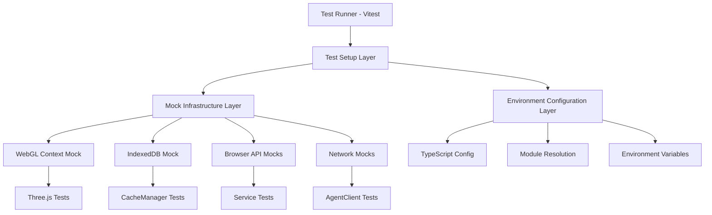
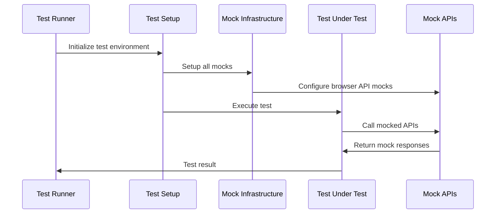

# Frontend Test Environment Setup Design

## Overview

The Frontend Test Environment Setup provides a comprehensive testing infrastructure that enables reliable execution of all frontend tests in both local development and CI/CD environments. The design addresses the core issues preventing the pre-push hook from succeeding by implementing proper WebGL context initialization, comprehensive browser API mocking, CacheManager initialization, and robust async operation handling.

The solution focuses on creating a test environment that closely mirrors production behavior while providing the necessary abstractions for headless testing. This ensures that the 32 currently failing frontend tests can execute reliably without external dependencies.

## Architecture

### Test Environment Layers



### Component Interaction Flow



## Components and Interfaces

### 1. Test Setup Infrastructure

**TestEnvironmentSetup**
```typescript
interface TestEnvironmentSetup {
  setupWebGL(): Promise<void>;
  setupIndexedDB(): Promise<void>;
  setupBrowserAPIs(): Promise<void>;
  setupCacheManager(): Promise<void>;
  teardown(): Promise<void>;
}
```

**WebGLTestContext**
```typescript
interface WebGLTestContext {
  canvas: HTMLCanvasElement;
  gl: WebGLRenderingContext;
  renderer: THREE.WebGLRenderer;
  createMockContext(): WebGLRenderingContext;
}
```

### 2. Mock Infrastructure

**CacheManagerMock**
```typescript
interface CacheManagerMock {
  isInitialized: boolean;
  mockStorage: Map<string, any>;
  get(key: string): Promise<any>;
  set(key: string, value: any): Promise<void>;
  delete(key: string): Promise<void>;
  clear(): Promise<void>;
  initialize(): Promise<void>;
}
```

**IndexedDBMock**
```typescript
interface IndexedDBMock {
  databases: Map<string, MockDatabase>;
  open(name: string, version?: number): Promise<MockDatabase>;
  deleteDatabase(name: string): Promise<void>;
}
```

### 3. Browser API Mocks

**BrowserAPIMocks**
```typescript
interface BrowserAPIMocks {
  localStorage: MockStorage;
  sessionStorage: MockStorage;
  fetch: MockFetch;
  XMLHttpRequest: MockXMLHttpRequest;
  WebAudioAPI: MockWebAudioAPI;
  File: MockFile;
  Blob: MockBlob;
}
```

### 4. Test Utilities

**AsyncTestUtils**
```typescript
interface AsyncTestUtils {
  waitFor(condition: () => boolean, timeout?: number): Promise<void>;
  flushPromises(): Promise<void>;
  advanceTimers(ms: number): void;
  mockTimers(): void;
  restoreTimers(): void;
}
```

## Data Models

### Test Configuration

```typescript
interface TestConfig {
  timeout: number;
  retries: number;
  parallel: boolean;
  coverage: {
    enabled: boolean;
    threshold: {
      lines: number;
      functions: number;
      branches: number;
    };
  };
  mocks: {
    webgl: boolean;
    indexeddb: boolean;
    browserAPIs: boolean;
    network: boolean;
  };
}
```

### Mock State Management

```typescript
interface MockState {
  webgl: {
    context: WebGLRenderingContext | null;
    canvas: HTMLCanvasElement | null;
  };
  cache: {
    initialized: boolean;
    storage: Map<string, any>;
  };
  network: {
    responses: Map<string, MockResponse>;
    intercepted: boolean;
  };
}
```

## Error Handling

### Test Environment Errors

1. **WebGL Context Creation Failure**
   - Detect missing canvas package
   - Provide installation instructions
   - Fallback to software rendering mock

2. **CacheManager Initialization Failure**
   - Detect IndexedDB mock issues
   - Provide mock state debugging
   - Reset mock state between tests

3. **Async Operation Timeouts**
   - Increase timeout for CI environments
   - Provide detailed timeout context
   - Suggest performance optimizations

4. **Mock Setup Failures**
   - Validate mock configuration
   - Provide mock state inspection
   - Reset to clean state on failure

### Error Recovery Strategies

```typescript
interface ErrorRecovery {
  retryWithFallback(operation: () => Promise<void>, fallback: () => Promise<void>): Promise<void>;
  resetMockState(): Promise<void>;
  validateEnvironment(): Promise<EnvironmentStatus>;
  provideDiagnostics(): TestDiagnostics;
}
```

## Testing Strategy

### Test Categories

1. **Unit Tests**
   - Individual component testing
   - Mock validation
   - Utility function testing

2. **Integration Tests**
   - Service interaction testing
   - Cache integration testing
   - API contract testing

3. **Environment Tests**
   - Mock setup validation
   - Performance benchmarking
   - CI/CD compatibility testing

### Test Execution Strategy


### Performance Optimization

1. **Parallel Execution**
   - Isolate test environments
   - Prevent resource conflicts
   - Optimize test scheduling

2. **Mock Caching**
   - Reuse expensive mock setups
   - Cache WebGL contexts
   - Optimize IndexedDB operations

3. **Selective Testing**
   - File-based filtering
   - Component-based grouping
   - Changed file detection

## Implementation Phases

### Phase 1: Core Infrastructure
- Install canvas package for WebGL support
- Create basic test setup utilities
- Implement WebGL context mocking

### Phase 2: Cache and Storage Mocking
- Implement IndexedDB mock infrastructure
- Create CacheManager test utilities
- Setup storage mock persistence

### Phase 3: Browser API Mocking
- Implement comprehensive browser API mocks
- Create network request mocking
- Setup audio and file API mocks

### Phase 4: Test Environment Integration
- Configure Vitest for optimal performance
- Implement test isolation mechanisms
- Setup coverage reporting

### Phase 5: CI/CD Integration
- Optimize for CI/CD environments
- Implement test artifact collection
- Setup performance monitoring

## Configuration Files

### Vitest Configuration
```typescript
// vitest.config.ts
export default defineConfig({
  test: {
    environment: 'jsdom',
    setupFiles: ['./tests/setup.ts'],
    globals: true,
    coverage: {
      provider: 'v8',
      reporter: ['text', 'json', 'html'],
      threshold: {
        lines: 80,
        functions: 80,
        branches: 80
      }
    },
    timeout: 10000,
    testTimeout: 5000
  }
});
```

### Test Setup Configuration
```typescript
// tests/setup.ts
import { setupTestEnvironment } from './utils/testSetup';
import { installMocks } from './mocks';

beforeAll(async () => {
  await setupTestEnvironment();
  installMocks();
});

afterEach(() => {
  resetMocks();
});
```

## Dependencies

### Required Packages
- `canvas` - WebGL context for headless testing
- `jsdom` - DOM environment for tests
- `@vitest/coverage-v8` - Coverage reporting
- `fake-indexeddb` - IndexedDB mocking
- `whatwg-fetch` - Fetch API polyfill

### Development Dependencies
- `@types/canvas` - TypeScript definitions
- `@types/jsdom` - DOM type definitions
- `vitest` - Test runner
- `@testing-library/jest-dom` - DOM testing utilities

## Success Metrics

### Test Execution Metrics
- All 32 failing tests pass consistently
- Test execution time under 60 seconds
- Zero flaky test failures
- 100% mock coverage for browser APIs

### Quality Metrics
- Code coverage above 80% threshold
- Zero test environment setup failures
- Consistent performance across environments
- Clear error messages for all failure modes