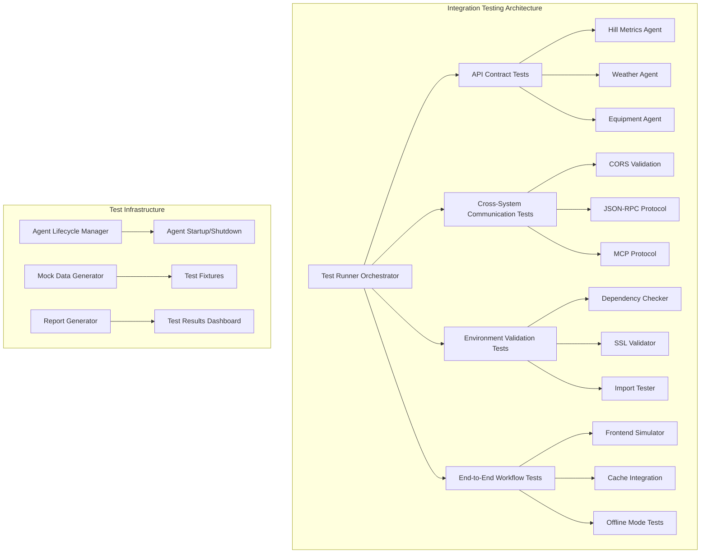
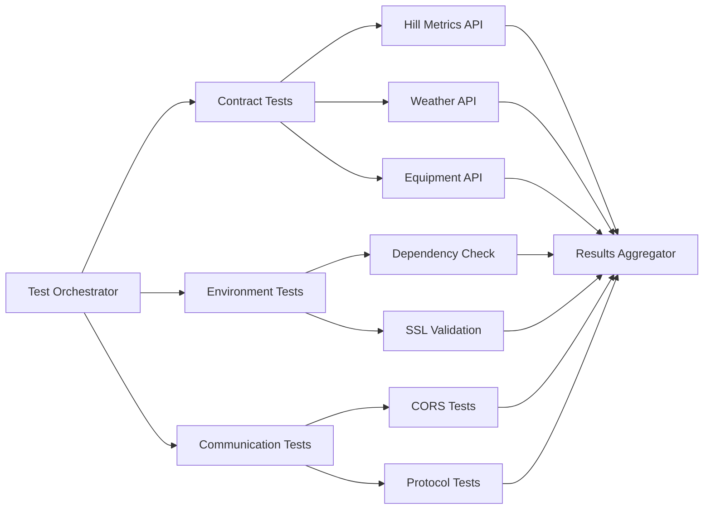

# Integration Testing Infrastructure Design

## Overview

The Integration Testing Infrastructure provides comprehensive end-to-end validation for the Alpine Ski Slope Environment Viewer's multi-agent architecture. The system implements a layered testing approach that validates API contracts, cross-system communication, environment consistency, and complete user workflows. The design emphasizes fast feedback, reliable detection of integration issues, and actionable diagnostic information to maintain system reliability across development and deployment cycles.

## Architecture

### Testing Layers



### Component Architecture

The testing infrastructure consists of four primary components:

1. **Test Orchestrator**: Manages test execution, agent lifecycle, and result aggregation
2. **Contract Validators**: Verify API compatibility between frontend and backend services
3. **Environment Validators**: Ensure system dependencies and configuration are correct
4. **Workflow Simulators**: Execute complete user scenarios end-to-end

## Components and Interfaces

### Test Orchestrator

**Purpose**: Central coordination of all integration testing activities

**Key Interfaces**:
- `TestRunner`: Main entry point for test execution
- `AgentManager`: Handles agent server lifecycle during testing
- `ResultAggregator`: Collects and processes test results

**Implementation**:
```python
class IntegrationTestOrchestrator:
    def __init__(self, config: TestConfig):
        self.agent_manager = AgentLifecycleManager()
        self.contract_validator = APIContractValidator()
        self.environment_validator = EnvironmentValidator()
        self.workflow_simulator = WorkflowSimulator()
    
    async def run_full_suite(self) -> TestResults:
        # Start agents, run tests, collect results
        pass
    
    async def run_selective_tests(self, categories: List[str]) -> TestResults:
        # Run specific test categories
        pass
```

### API Contract Validator

**Purpose**: Validates frontend-backend API compatibility

**Key Features**:
- Method signature validation
- Parameter structure verification
- Response format checking
- Error handling validation

**Implementation Strategy**:
- Uses reflection to discover available agent methods
- Compares against frontend AgentClient method calls
- Validates JSON-RPC protocol compliance
- Tests error scenarios and edge cases

### Cross-System Communication Validator

**Purpose**: Ensures proper network communication between components

**Key Features**:
- CORS header validation
- Protocol compliance testing
- Network timeout handling
- Data serialization verification

**Test Scenarios**:
- Cross-origin requests from different domains
- Large data transfer scenarios
- Network interruption simulation
- Protocol version compatibility

### Environment Validator

**Purpose**: Verifies system environment and dependencies

**Key Features**:
- Package manager consistency checking
- SSL/TLS configuration validation
- Import dependency verification
- System resource availability

**Validation Process**:
1. Check Python environment setup (uv vs pip usage)
2. Validate SSL certificate chain
3. Test all module imports
4. Verify system resource availability

### Workflow Simulator

**Purpose**: Executes complete user scenarios end-to-end

**Key Workflows**:
- Terrain loading and rendering
- Cache integration and offline mode
- Error handling and recovery
- Performance under load

**Simulation Approach**:
- Programmatic frontend interaction simulation
- Real agent server communication
- Cache state manipulation
- Network condition simulation

## Data Models

### Test Configuration

```typescript
interface TestConfig {
  agents: {
    hillMetrics: AgentConfig;
    weather: AgentConfig;
    equipment: AgentConfig;
  };
  timeouts: {
    agentStartup: number;
    testExecution: number;
    networkRequest: number;
  };
  environment: {
    pythonPath: string;
    nodeVersion: string;
    sslValidation: boolean;
  };
  reporting: {
    outputFormat: 'json' | 'html' | 'junit';
    detailLevel: 'minimal' | 'standard' | 'verbose';
  };
}
```

### Test Results

```typescript
interface TestResults {
  summary: {
    totalTests: number;
    passed: number;
    failed: number;
    skipped: number;
    duration: number;
  };
  categories: {
    apiContracts: CategoryResults;
    communication: CategoryResults;
    environment: CategoryResults;
    workflows: CategoryResults;
  };
  diagnostics: {
    agentHealth: AgentHealthStatus[];
    environmentIssues: EnvironmentIssue[];
    performanceMetrics: PerformanceMetrics;
  };
}
```

### Agent Health Status

```python
@dataclass
class AgentHealthStatus:
    name: str
    status: Literal['healthy', 'degraded', 'failed']
    response_time: float
    last_error: Optional[str]
    available_methods: List[str]
    missing_methods: List[str]
```

## Error Handling

### Error Categories

1. **Environment Errors**: SSL issues, missing dependencies, package manager conflicts
2. **Communication Errors**: CORS failures, network timeouts, protocol violations
3. **Contract Errors**: Missing methods, parameter mismatches, response format issues
4. **Workflow Errors**: End-to-end scenario failures, cache corruption, performance degradation

### Error Recovery Strategies

- **Graceful Degradation**: Continue testing when non-critical components fail
- **Retry Logic**: Automatic retry for transient network issues
- **Fallback Testing**: Use mock data when live agents are unavailable
- **Diagnostic Collection**: Capture detailed context for debugging

### Error Reporting

```python
class TestError:
    def __init__(self, category: str, severity: str, message: str, 
                 context: Dict[str, Any], suggested_fix: str):
        self.category = category
        self.severity = severity  # 'critical', 'warning', 'info'
        self.message = message
        self.context = context
        self.suggested_fix = suggested_fix
        self.timestamp = datetime.now()
```

## Testing Strategy

### Test Execution Phases

1. **Pre-flight Checks**: Environment validation and agent health verification
2. **Contract Validation**: API method and protocol compliance testing
3. **Communication Testing**: Cross-system interaction validation
4. **Workflow Simulation**: End-to-end scenario execution
5. **Performance Validation**: Load testing and resource usage verification
6. **Cleanup and Reporting**: Result aggregation and diagnostic collection

### Test Data Management

- **Mock Data Generation**: Realistic test fixtures for offline testing
- **Cache State Management**: Controlled cache scenarios for testing
- **Network Simulation**: Configurable network conditions and failures
- **Load Generation**: Scalable load testing for performance validation

### Parallel Execution Strategy



### Performance Requirements

- **Test Execution Time**: Complete suite under 5 minutes
- **Agent Startup Time**: All agents ready within 30 seconds
- **Parallel Execution**: Support for concurrent test categories
- **Resource Usage**: Minimal impact on development environment

## Integration Points

### CI/CD Pipeline Integration

```yaml
# Example GitHub Actions integration
integration_tests:
  runs-on: ubuntu-latest
  steps:
    - name: Setup Environment
      run: |
        uv sync
        npm install
    
    - name: Run Integration Tests
      run: |
        uv run python scripts/test_integration.py --ci-mode
    
    - name: Upload Test Results
      uses: actions/upload-artifact@v3
      with:
        name: integration-test-results
        path: test-results/
```

### Development Workflow Integration

- **Pre-commit Hooks**: Lightweight contract validation
- **Local Development**: Selective test execution for rapid feedback
- **Pull Request Validation**: Full integration test suite
- **Deployment Validation**: Production smoke tests

### Monitoring and Alerting

- **Continuous Testing**: Periodic integration test execution in production
- **Health Monitoring**: Real-time agent health and performance tracking
- **Alert Thresholds**: Automated notifications for test failures or performance degradation
- **Trend Analysis**: Historical test performance and reliability metrics

## Security Considerations

### Test Data Security

- **Sensitive Data Handling**: No real user data in test scenarios
- **API Key Management**: Secure handling of test credentials
- **Network Security**: Encrypted communication for test traffic
- **Access Control**: Restricted access to test infrastructure

### Environment Isolation

- **Test Environment Separation**: Isolated test environments prevent production impact
- **Resource Limits**: Bounded resource usage for test execution
- **Cleanup Procedures**: Automatic cleanup of test artifacts and temporary data
- **Audit Logging**: Comprehensive logging of test activities for security review