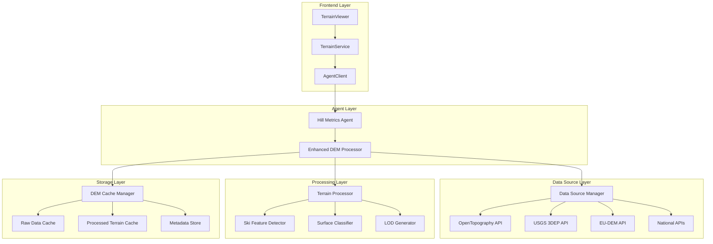
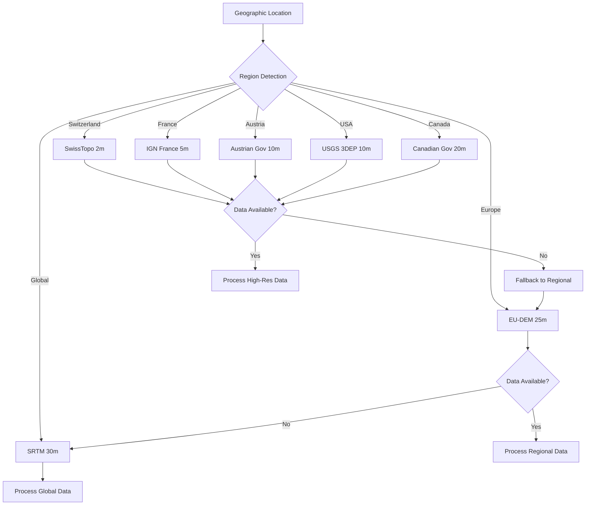
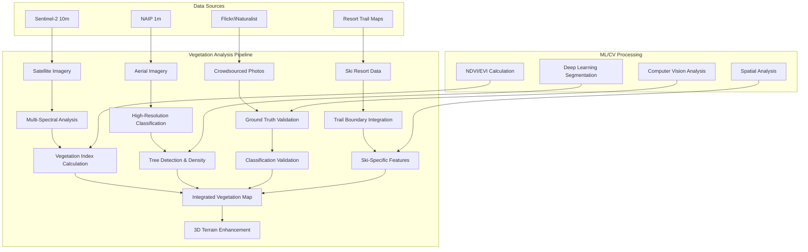

# Realistic Terrain Data Sources Design

## Overview

The Realistic Terrain Data Sources system replaces synthetic terrain generation with authentic Digital Elevation Model (DEM) data from authoritative sources. The design implements a multi-tiered data source architecture that intelligently selects the highest resolution data available for each geographic region, with robust fallback mechanisms and performance optimization. The system integrates with established geospatial APIs, implements efficient caching strategies, and provides ski-specific terrain analysis to deliver realistic representations of world-renowned ski areas.

## Architecture

### System Architecture



### Data Source Hierarchy



## Components and Interfaces

### Enhanced DEM Processor

**Purpose**: Orchestrates terrain data acquisition, processing, and caching with real DEM sources.

**Key Interfaces**:
```python
class EnhancedDEMProcessor:
    async def process_terrain(
        self, 
        bounds: GeographicBounds, 
        grid_size: GridSize,
        include_ski_features: bool = True
    ) -> HillMetrics
    
    async def get_elevation_profile(
        self,
        start_point: GeoPoint,
        end_point: GeoPoint,
        num_points: int = 100
    ) -> ElevationProfile
    
    async def validate_terrain_data(
        self,
        bounds: GeographicBounds,
        reference_points: List[ValidationPoint]
    ) -> ValidationResult
```

### Data Source Manager

**Purpose**: Manages multiple DEM data sources with intelligent selection and fallback logic.

**Key Interfaces**:
```python
class DataSourceManager:
    def __init__(self):
        self.sources = {
            'high_res': {
                'switzerland': SwissTopoAPI(),
                'france': IGNFranceAPI(),
                'austria': AustrianGovAPI(),
                'usa': USGS3DEPAPI()
            },
            'regional': {
                'europe': EUDEMApi(),
                'north_america': CANDEMApi()
            },
            'global': {
                'srtm': OpenTopographySRTMAPI(),
                'aster': OpenTopographyASTERAPI()
            }
        }
    
    async def get_best_data_source(
        self, 
        bounds: GeographicBounds
    ) -> DataSourceInfo
    
    async def fetch_dem_data(
        self,
        bounds: GeographicBounds,
        source: DataSourceInfo
    ) -> DEMData
```

### Integrated Vegetation Analyzer

**Purpose**: Comprehensive vegetation analysis using multiple data sources and computer vision techniques.

**Key Features**:
- Multi-spectral satellite imagery analysis
- High-resolution aerial imagery processing
- Crowdsourced photo validation
- Machine learning vegetation classification
- Ski-specific feature integration

**Implementation**:
```python
class IntegratedVegetationAnalyzer:
    def __init__(self):
        self.satellite_analyzer = SatelliteVegetationAnalyzer()
        self.aerial_analyzer = AerialImageryAnalyzer()
        self.photo_analyzer = CrowdsourcedPhotoAnalyzer()
        self.ml_classifier = VegetationMLClassifier()
        self.ski_integrator = SkiResortDataIntegrator()
    
    async def analyze_comprehensive_vegetation(
        self,
        bounds: GeographicBounds,
        ski_area: str
    ) -> VegetationData:
        """Perform comprehensive vegetation analysis using all available sources."""
        
        # 1. Satellite-based vegetation analysis
        satellite_data = await self.satellite_analyzer.fetch_sentinel2_data(bounds)
        ndvi_map = self.satellite_analyzer.calculate_ndvi(satellite_data)
        evi_map = self.satellite_analyzer.calculate_evi(satellite_data)
        base_classification = self.ml_classifier.classify_vegetation(
            satellite_data, ndvi_map, evi_map
        )
        
        # 2. High-resolution aerial enhancement (where available)
        if await self.aerial_analyzer.has_coverage(bounds):
            aerial_data = await self.aerial_analyzer.fetch_aerial_imagery(bounds)
            enhanced_classification = self.aerial_analyzer.refine_classification(
                base_classification, aerial_data
            )
            tree_locations = self.aerial_analyzer.detect_individual_trees(aerial_data)
        else:
            enhanced_classification = base_classification
            tree_locations = None
        
        # 3. Crowdsourced validation
        validation_points = await self.photo_analyzer.analyze_geotagged_photos(bounds)
        validated_classification = self.photo_analyzer.validate_classification(
            enhanced_classification, validation_points
        )
        
        # 4. Ski resort data integration
        resort_data = await self.ski_integrator.fetch_resort_data(ski_area)
        final_classification = self.ski_integrator.integrate_ski_features(
            validated_classification, resort_data
        )
        
        # 5. Generate confidence map
        confidence_map = self.calculate_classification_confidence(
            satellite_data, validation_points, resort_data
        )
        
        return VegetationData(
            vegetation_classification=final_classification,
            vegetation_density=self.calculate_density_map(final_classification),
            ndvi_values=ndvi_map,
            evi_values=evi_map,
            confidence_map=confidence_map,
            data_sources=['sentinel2', 'aerial', 'crowdsourced', 'ski_resort'],
            processing_date=datetime.now()
        )

class SatelliteVegetationAnalyzer:
    """Analyzes vegetation from multi-spectral satellite imagery."""
    
    def calculate_ndvi(self, satellite_data: SatelliteImagery) -> np.ndarray:
        """Calculate Normalized Difference Vegetation Index."""
        red = satellite_data.bands['red']
        nir = satellite_data.bands['near_infrared']
        return (nir - red) / (nir + red + 1e-8)  # Add small value to avoid division by zero
    
    def calculate_evi(self, satellite_data: SatelliteImagery) -> np.ndarray:
        """Calculate Enhanced Vegetation Index for dense canopy areas."""
        red = satellite_data.bands['red']
        nir = satellite_data.bands['near_infrared']
        blue = satellite_data.bands['blue']
        return 2.5 * ((nir - red) / (nir + 6 * red - 7.5 * blue + 1))
    
    def detect_treeline_boundary(
        self, 
        ndvi_map: np.ndarray, 
        elevation_data: np.ndarray,
        ski_area_config: dict
    ) -> List[GeoPoint]:
        """Detect treeline boundary using vegetation and elevation analysis."""
        
        # Use elevation-based treeline estimation as starting point
        estimated_treeline = ski_area_config['treeline_elevation']
        
        # Find vegetation transition zones near estimated treeline
        elevation_mask = np.abs(elevation_data - estimated_treeline) < 200
        vegetation_transition = self.find_vegetation_transitions(
            ndvi_map, elevation_mask
        )
        
        # Refine treeline using vegetation gradient analysis
        refined_treeline = self.refine_treeline_with_gradients(
            vegetation_transition, elevation_data, ndvi_map
        )
        
        return refined_treeline

class CrowdsourcedPhotoAnalyzer:
    """Analyzes crowdsourced geotagged photography for vegetation validation."""
    
    async def analyze_geotagged_photos(
        self, 
        bounds: GeographicBounds
    ) -> List[CrowdsourcedValidationPoint]:
        """Analyze geotagged photos from multiple platforms."""
        
        validation_points = []
        
        # Flickr analysis
        flickr_photos = await self.fetch_flickr_photos(bounds)
        for photo in flickr_photos:
            vegetation_analysis = self.analyze_photo_vegetation(photo.image_data)
            validation_points.append(CrowdsourcedValidationPoint(
                latitude=photo.latitude,
                longitude=photo.longitude,
                vegetation_class=vegetation_analysis.dominant_class,
                confidence=vegetation_analysis.confidence,
                photo_url=photo.url,
                analysis_date=datetime.now(),
                source_platform='flickr',
                seasonal_context=self.determine_season_from_photo(photo)
            ))
        
        # iNaturalist observations
        inaturalist_obs = await self.fetch_inaturalist_observations(bounds)
        for obs in inaturalist_obs:
            if obs.taxon_type in ['tree', 'shrub', 'grass']:
                validation_points.append(CrowdsourcedValidationPoint(
                    latitude=obs.latitude,
                    longitude=obs.longitude,
                    vegetation_class=self.map_taxon_to_vegetation_class(obs.taxon_type),
                    confidence=obs.research_grade_confidence,
                    analysis_date=obs.observed_on,
                    source_platform='inaturalist'
                ))
        
        return validation_points
    
    def analyze_photo_vegetation(self, image_data: np.ndarray) -> VegetationAnalysisResult:
        """Use computer vision to analyze vegetation in photos."""
        
        # Use pre-trained segmentation model
        segmentation = self.vegetation_segmentation_model.predict(image_data)
        
        # Calculate vegetation class percentages
        class_percentages = {}
        total_pixels = segmentation.size
        
        for veg_class in VegetationClass:
            class_pixels = np.sum(segmentation == veg_class.value)
            class_percentages[veg_class] = class_pixels / total_pixels
        
        # Determine dominant class and confidence
        dominant_class = max(class_percentages, key=class_percentages.get)
        confidence = class_percentages[dominant_class]
        
        return VegetationAnalysisResult(
            dominant_class=dominant_class,
            class_percentages=class_percentages,
            confidence=confidence
        )

class SkiFeatureDetector:
    """Enhanced ski feature detection with vegetation context."""
    
    def detect_ski_runs_with_vegetation(
        self, 
        elevation_data: np.ndarray,
        slope_data: np.ndarray,
        vegetation_data: VegetationData
    ) -> List[SkiRun]:
        """Detect ski runs considering vegetation patterns."""
        
        # Find areas with optimal skiing slopes
        ski_slopes = np.where((slope_data > 15) & (slope_data < 45))
        
        # Consider vegetation context for run detection
        open_areas = np.where(
            (vegetation_data.vegetation_classification == VegetationClass.GROOMED_RUN) |
            (vegetation_data.vegetation_classification == VegetationClass.ALPINE_MEADOW) |
            (vegetation_data.vegetation_classification == VegetationClass.SPARSE_TREES)
        )
        
        # Combine slope and vegetation criteria
        potential_runs = np.intersect1d(ski_slopes[0] * slope_data.shape[1] + ski_slopes[1],
                                      open_areas[0] * slope_data.shape[1] + open_areas[1])
        
        # Use watershed analysis on combined criteria
        runs = self._watershed_analysis_with_vegetation(
            elevation_data, potential_runs, vegetation_data
        )
        
        # Enhance runs with vegetation context
        enhanced_runs = []
        for run in runs:
            vegetation_context = self._analyze_run_vegetation_context(
                run, vegetation_data
            )
            
            enhanced_run = SkiRun(
                name=run.name,
                path_coordinates=run.path_coordinates,
                difficulty_rating=run.difficulty_rating,
                average_slope=run.average_slope,
                max_slope=run.max_slope,
                vertical_drop=run.vertical_drop,
                estimated_length=run.estimated_length,
                surface_type=run.surface_type,
                vegetation_context=vegetation_context,
                tree_density_along_path=self._calculate_tree_density_along_path(
                    run.path_coordinates, vegetation_data
                ),
                is_groomed=self._is_groomed_run(run, vegetation_data),
                has_tree_skiing=self._has_tree_skiing_potential(run, vegetation_data)
            )
            
            enhanced_runs.append(enhanced_run)
        
        return enhanced_runs
```

### Enhanced Ski Area Definitions

**Updated Boundaries**: Realistic ski area coverage based on actual resort boundaries with vegetation analysis configuration.

```python
ENHANCED_SKI_AREAS = {
    'chamonix': {
        'bounds': GeographicBounds(
            north=45.9500, south=45.8800,
            east=6.9200, west=6.8200
        ),
        'priority_sources': ['ign_france', 'eu_dem', 'srtm'],
        'vegetation_sources': ['sentinel2', 'crowdsourced_photos', 'ski_resort_data'],
        'key_features': ['aiguille_du_midi', 'vallee_blanche', 'grands_montets'],
        'elevation_range': (1035, 3842),
        'treeline_elevation': 2200,
        'vegetation_zones': {
            'dense_forest': (1035, 1800),
            'mixed_forest': (1800, 2000),
            'alpine_meadow': (2000, 2200),
            'alpine_zone': (2200, 3000),
            'glacial_zone': (3000, 3842)
        }
    },
    'zermatt': {
        'bounds': GeographicBounds(
            north=46.0200, south=45.9200,
            east=7.8000, west=7.7000
        ),
        'priority_sources': ['swisstopo', 'eu_dem', 'srtm'],
        'vegetation_sources': ['sentinel2', 'swisstopo_aerial', 'crowdsourced_photos'],
        'key_features': ['matterhorn', 'klein_matterhorn', 'gornergrat'],
        'elevation_range': (1620, 3883),
        'treeline_elevation': 2100,
        'vegetation_zones': {
            'coniferous_forest': (1620, 1900),
            'mixed_alpine': (1900, 2100),
            'alpine_meadow': (2100, 2400),
            'alpine_desert': (2400, 3200),
            'glacial_zone': (3200, 3883)
        }
    },
    'copper_mountain': {
        'bounds': GeographicBounds(
            north=39.5200, south=39.4600,
            east=-106.1300, west=-106.2000
        ),
        'priority_sources': ['usgs_3dep', 'naip_aerial', 'srtm'],
        'vegetation_sources': ['naip_aerial', 'landsat8', 'ski_resort_data'],
        'key_features': ['copper_bowl', 'resolution_bowl', 'spaulding_bowl'],
        'elevation_range': (2926, 3962),
        'treeline_elevation': 3500,
        'vegetation_zones': {
            'montane_forest': (2926, 3200),
            'subalpine_forest': (3200, 3500),
            'alpine_tundra': (3500, 3800),
            'alpine_zone': (3800, 3962)
        }
    }
}
```

### Vegetation Analysis Architecture



## Data Models

### Enhanced Terrain Data Models

```python
@dataclass
class DEMMetadata:
    """Metadata for DEM data sources."""
    source_name: str
    resolution_meters: float
    acquisition_date: datetime
    coordinate_system: str
    vertical_datum: str
    accuracy_meters: float
    coverage_bounds: GeographicBounds

@dataclass
class VegetationData:
    """Comprehensive vegetation analysis results."""
    vegetation_classification: np.ndarray  # Classification grid
    vegetation_density: np.ndarray  # Density percentage (0-100)
    canopy_height: Optional[np.ndarray]  # Height above ground (from LiDAR)
    ndvi_values: np.ndarray  # Normalized Difference Vegetation Index
    evi_values: Optional[np.ndarray]  # Enhanced Vegetation Index
    confidence_map: np.ndarray  # Classification confidence (0-1)
    seasonal_variation: Optional[Dict[str, np.ndarray]]  # Multi-temporal data
    data_sources: List[str]  # Sources used for analysis
    processing_date: datetime

@dataclass
class VegetationClass(Enum):
    """Vegetation classification types for ski areas."""
    DENSE_FOREST = "dense_forest"
    SPARSE_TREES = "sparse_trees"
    ALPINE_MEADOW = "alpine_meadow"
    BARE_ROCK = "bare_rock"
    SNOW_ICE = "snow_ice"
    GROOMED_RUN = "groomed_run"
    LIFT_CORRIDOR = "lift_corridor"
    WATER = "water"
    DEVELOPED_AREA = "developed_area"

@dataclass
class SkiRun:
    """Detected ski run information with vegetation context."""
    name: str
    path_coordinates: List[GeoPoint]
    difficulty_rating: SkiRunDifficulty
    average_slope: float
    max_slope: float
    vertical_drop: float
    estimated_length: float
    surface_type: SurfaceType
    vegetation_context: VegetationContext  # Surrounding vegetation
    tree_density_along_path: List[float]  # Density at each point
    is_groomed: bool
    has_tree_skiing: bool

@dataclass
class VegetationContext:
    """Vegetation context for ski runs and terrain features."""
    dominant_vegetation: VegetationClass
    vegetation_percentages: Dict[VegetationClass, float]
    tree_line_proximity: float  # Distance to treeline in meters
    canopy_coverage: float  # Percentage canopy coverage
    seasonal_accessibility: Dict[str, bool]  # Seasonal access patterns

@dataclass
class TerrainFeatures:
    """Ski-specific terrain features with vegetation analysis."""
    ski_runs: List[SkiRun]
    cliff_areas: np.ndarray
    tree_lines: List[GeoPoint]
    avalanche_zones: List[PolygonArea]
    lift_corridors: List[LiftCorridor]
    vegetation_zones: Dict[VegetationClass, List[PolygonArea]]
    tree_skiing_areas: List[PolygonArea]
    open_bowls: List[PolygonArea]
    base_facilities: List[PolygonArea]
    
@dataclass
class EnhancedHillMetrics:
    """Enhanced hill metrics with real data and vegetation analysis."""
    elevation: ElevationData
    slope: SlopeData
    aspect: AspectData
    surface_classification: SurfaceClassification
    vegetation_data: VegetationData
    ski_features: TerrainFeatures
    metadata: DEMMetadata
    processing_stats: ProcessingStats

@dataclass
class CrowdsourcedValidationPoint:
    """Validation point from crowdsourced imagery."""
    latitude: float
    longitude: float
    vegetation_class: VegetationClass
    confidence: float
    photo_url: Optional[str]
    analysis_date: datetime
    source_platform: str  # 'flickr', 'inaturalist', 'mapillary'
    seasonal_context: Optional[str]  # 'summer', 'winter', 'spring', 'fall'
```

### Data Source Configuration

```python
@dataclass
class DataSourceConfig:
    """Configuration for DEM data sources."""
    name: str
    api_endpoint: str
    api_key_env_var: Optional[str]
    rate_limit_per_hour: int
    max_area_km2: float
    supported_formats: List[str]
    coordinate_systems: List[str]
    resolution_meters: float
    coverage_regions: List[str]

DATA_SOURCE_CONFIGS = {
    'usgs_3dep': DataSourceConfig(
        name='USGS 3DEP',
        api_endpoint='https://elevation.nationalmap.gov/arcgis/rest/services',
        api_key_env_var=None,  # Public API
        rate_limit_per_hour=1000,
        max_area_km2=100,
        supported_formats=['GTiff', 'IMG'],
        coordinate_systems=['EPSG:4326', 'EPSG:3857'],
        resolution_meters=10.0,
        coverage_regions=['usa']
    ),
    'opentopography_srtm': DataSourceConfig(
        name='OpenTopography SRTM',
        api_endpoint='https://cloud.sdsc.edu/v1/AUTH_opentopography/Raster',
        api_key_env_var='OPENTOPOGRAPHY_API_KEY',
        rate_limit_per_hour=100,
        max_area_km2=1000,
        supported_formats=['GTiff'],
        coordinate_systems=['EPSG:4326'],
        resolution_meters=30.0,
        coverage_regions=['global']
    )
}
```

## Error Handling

### Comprehensive Error Recovery

```python
class TerrainDataError(Exception):
    """Base exception for terrain data errors."""
    pass

class DataSourceUnavailableError(TerrainDataError):
    """Raised when a data source is unavailable."""
    def __init__(self, source_name: str, retry_after: Optional[int] = None):
        self.source_name = source_name
        self.retry_after = retry_after
        super().__init__(f"Data source {source_name} unavailable")

class TerrainProcessingError(TerrainDataError):
    """Raised when terrain processing fails."""
    def __init__(self, bounds: GeographicBounds, processing_step: str):
        self.bounds = bounds
        self.processing_step = processing_step
        super().__init__(f"Terrain processing failed at {processing_step}")

class DataValidationError(TerrainDataError):
    """Raised when terrain data validation fails."""
    def __init__(self, validation_failures: List[str]):
        self.validation_failures = validation_failures
        super().__init__(f"Data validation failed: {validation_failures}")
```

### Fallback Strategy Implementation

```python
class FallbackManager:
    """Manages fallback strategies for terrain data acquisition."""
    
    async def execute_with_fallback(
        self,
        bounds: GeographicBounds,
        primary_sources: List[str]
    ) -> DEMData:
        """Execute data acquisition with automatic fallback."""
        
        errors = []
        
        for source_name in primary_sources:
            try:
                logger.info(f"Attempting to fetch data from {source_name}")
                
                source = self.data_sources[source_name]
                data = await source.fetch_data(bounds)
                
                # Validate data quality
                if self._validate_data_quality(data, bounds):
                    logger.info(f"Successfully acquired data from {source_name}")
                    return data
                else:
                    raise DataValidationError([f"Poor data quality from {source_name}"])
                    
            except Exception as e:
                logger.warning(f"Failed to fetch from {source_name}: {e}")
                errors.append((source_name, str(e)))
                
                # Implement exponential backoff for retryable errors
                if isinstance(e, DataSourceUnavailableError) and e.retry_after:
                    await asyncio.sleep(min(e.retry_after, 60))
                    continue
        
        # If all sources failed, try cached data
        cached_data = await self.cache_manager.get_cached_data(bounds)
        if cached_data:
            logger.info("Using cached data as fallback")
            return cached_data
        
        # Final fallback: raise comprehensive error
        raise TerrainDataError(
            f"All data sources failed for bounds {bounds}. Errors: {errors}"
        )
```

## Testing Strategy

### Data Source Integration Tests

```python
class TestDataSourceIntegration:
    """Integration tests for real data sources."""
    
    @pytest.mark.asyncio
    async def test_usgs_3dep_integration(self):
        """Test USGS 3DEP data acquisition for Copper Mountain."""
        bounds = ENHANCED_SKI_AREAS['copper_mountain']['bounds']
        
        processor = EnhancedDEMProcessor()
        data = await processor.fetch_usgs_3dep_data(bounds)
        
        assert data is not None
        assert data.resolution_meters <= 10.0
        assert data.elevation_range[0] >= 2900  # Copper Mountain base
        assert data.elevation_range[1] <= 4000  # Copper Mountain peak
    
    @pytest.mark.asyncio
    async def test_fallback_mechanism(self):
        """Test fallback from unavailable high-res to SRTM."""
        bounds = GeographicBounds(north=46.0, south=45.9, east=7.8, west=7.7)
        
        # Mock high-res source failure
        with patch('agents.hill_metrics.swisstopo_api.fetch_data') as mock_swiss:
            mock_swiss.side_effect = DataSourceUnavailableError('swisstopo')
            
            processor = EnhancedDEMProcessor()
            data = await processor.process_terrain(bounds, GridSize.MEDIUM)
            
            # Should fallback to SRTM
            assert data.metadata.source_name == 'SRTM'
            assert data.metadata.resolution_meters == 30.0

class TestSkiFeatureDetection:
    """Tests for ski-specific feature detection."""
    
    def test_ski_run_detection(self):
        """Test detection of natural ski runs."""
        # Create test elevation data with a natural run path
        elevation_data = self._create_test_ski_run_elevation()
        slope_data = self._calculate_test_slopes(elevation_data)
        
        detector = SkiFeatureDetector()
        runs = detector.detect_ski_runs(elevation_data, slope_data)
        
        assert len(runs) > 0
        assert all(15 <= run.average_slope <= 45 for run in runs)
        assert all(run.vertical_drop > 100 for run in runs)
```

### Performance Validation Tests

```python
class TestTerrainPerformance:
    """Performance tests for terrain processing."""
    
    @pytest.mark.performance
    async def test_large_area_processing_time(self):
        """Test processing time for large ski area."""
        bounds = ENHANCED_SKI_AREAS['chamonix']['bounds']  # ~80 km²
        
        start_time = time.time()
        processor = EnhancedDEMProcessor()
        data = await processor.process_terrain(bounds, GridSize.LARGE)
        processing_time = time.time() - start_time
        
        # Should process within 60 seconds
        assert processing_time < 60.0
        assert data is not None
    
    @pytest.mark.performance
    def test_memory_usage_large_dataset(self):
        """Test memory usage with large terrain datasets."""
        import psutil
        
        process = psutil.Process()
        initial_memory = process.memory_info().rss
        
        # Process large terrain area
        bounds = ENHANCED_SKI_AREAS['whistler']['bounds']
        processor = EnhancedDEMProcessor()
        data = processor.process_terrain(bounds, GridSize.EXTRA_LARGE)
        
        peak_memory = process.memory_info().rss
        memory_increase = peak_memory - initial_memory
        
        # Should not exceed 2GB additional memory
        assert memory_increase < 2 * 1024 * 1024 * 1024
```

## Security Considerations

### API Key Management

```python
class SecureCredentialManager:
    """Secure management of API credentials."""
    
    def __init__(self):
        self.credentials = {}
        self._load_credentials_from_env()
    
    def _load_credentials_from_env(self):
        """Load API credentials from environment variables."""
        credential_mappings = {
            'OPENTOPOGRAPHY_API_KEY': 'opentopography',
            'USGS_API_KEY': 'usgs',
            'SWISSTOPO_API_KEY': 'swisstopo'
        }
        
        for env_var, service in credential_mappings.items():
            credential = os.getenv(env_var)
            if credential:
                self.credentials[service] = credential
                logger.info(f"Loaded credentials for {service}")
            else:
                logger.warning(f"No credentials found for {service}")
    
    def get_credential(self, service: str) -> Optional[str]:
        """Get API credential for service."""
        return self.credentials.get(service)
```

### Data Validation and Sanitization

```python
class TerrainDataValidator:
    """Validates terrain data for security and correctness."""
    
    def validate_elevation_data(self, data: np.ndarray, bounds: GeographicBounds) -> bool:
        """Validate elevation data for reasonable values."""
        
        # Check for reasonable elevation ranges
        min_elevation = np.min(data)
        max_elevation = np.max(data)
        
        if min_elevation < -500 or max_elevation > 9000:
            logger.warning(f"Suspicious elevation range: {min_elevation} to {max_elevation}")
            return False
        
        # Check for data corruption (too many identical values)
        unique_values = len(np.unique(data))
        total_values = data.size
        
        if unique_values / total_values < 0.1:
            logger.warning("Data appears corrupted (too few unique values)")
            return False
        
        return True
    
    def sanitize_bounds(self, bounds: GeographicBounds) -> GeographicBounds:
        """Sanitize geographic bounds to prevent injection attacks."""
        
        # Ensure bounds are within valid geographic ranges
        north = max(-90, min(90, bounds.north))
        south = max(-90, min(90, bounds.south))
        east = max(-180, min(180, bounds.east))
        west = max(-180, min(180, bounds.west))
        
        # Ensure logical consistency
        if north <= south:
            raise ValueError("North bound must be greater than south bound")
        if east <= west:
            raise ValueError("East bound must be greater than west bound")
        
        return GeographicBounds(north=north, south=south, east=east, west=west)
```

## Comprehensive Vegetation Analysis System

### Multi-Source Data Integration Strategy

The vegetation analysis system combines multiple data sources to achieve maximum accuracy and detail:

```python
class VegetationDataSourceManager:
    """Manages multiple vegetation data sources with intelligent prioritization."""
    
    def __init__(self):
        self.data_sources = {
            'satellite': {
                'sentinel2': Sentinel2API(),  # 10m, 13 bands, 5-day revisit
                'landsat8': Landsat8API(),    # 30m, 11 bands, 16-day revisit
                'planet': PlanetAPI()         # 3m daily (commercial)
            },
            'aerial': {
                'naip': NAIPAPI(),           # 1m US coverage
                'swisstopo': SwissTopoAPI(), # 0.25m Swiss coverage
                'ign_france': IGNFranceAPI() # 0.5m French coverage
            },
            'crowdsourced': {
                'flickr': FlickrAPI(),
                'inaturalist': iNaturalistAPI(),
                'mapillary': MapillaryAPI()
            },
            'specialized': {
                'global_forest_watch': GlobalForestWatchAPI(),
                'esa_worldcover': ESAWorldCoverAPI(),
                'ski_resort_data': SkiResortAPI()
            }
        }
    
    async def get_optimal_vegetation_data(
        self, 
        bounds: GeographicBounds,
        ski_area: str
    ) -> IntegratedVegetationData:
        """Get optimal vegetation data using best available sources."""
        
        # Determine geographic region for source prioritization
        region = self.determine_region(bounds)
        
        # Get base satellite analysis
        base_data = await self._get_satellite_vegetation_analysis(bounds, region)
        
        # Enhance with high-resolution aerial data if available
        if region in ['usa', 'switzerland', 'france']:
            aerial_enhancement = await self._get_aerial_enhancement(bounds, region)
            base_data = self._merge_aerial_enhancement(base_data, aerial_enhancement)
        
        # Validate with crowdsourced data
        validation_data = await self._get_crowdsourced_validation(bounds)
        validated_data = self._apply_crowdsourced_validation(base_data, validation_data)
        
        # Integrate ski-specific features
        ski_data = await self._get_ski_resort_data(ski_area)
        final_data = self._integrate_ski_features(validated_data, ski_data)
        
        return final_data
```

### Computer Vision and Machine Learning Pipeline

```python
class VegetationMLPipeline:
    """Machine learning pipeline for vegetation analysis."""
    
    def __init__(self):
        self.models = {
            'segmentation': self._load_segmentation_model(),
            'tree_detection': self._load_tree_detection_model(),
            'density_estimation': self._load_density_model(),
            'seasonal_classifier': self._load_seasonal_model()
        }
    
    def _load_segmentation_model(self):
        """Load pre-trained vegetation segmentation model."""
        # Use models like DeepForest, TreeNet, or custom trained models
        return VegetationSegmentationModel(
            architecture='UNet',
            weights='vegetation_segmentation_v2.pth',
            classes=[
                'dense_forest', 'sparse_trees', 'alpine_meadow',
                'bare_rock', 'snow_ice', 'groomed_run', 'water'
            ]
        )
    
    async def process_satellite_imagery(
        self,
        satellite_data: SatelliteImagery
    ) -> VegetationClassification:
        """Process multi-spectral satellite imagery for vegetation analysis."""
        
        # Calculate vegetation indices
        ndvi = self.calculate_ndvi(satellite_data.red, satellite_data.nir)
        evi = self.calculate_evi(satellite_data.red, satellite_data.nir, satellite_data.blue)
        savi = self.calculate_savi(satellite_data.red, satellite_data.nir)
        
        # Prepare input features for ML model
        features = np.stack([
            satellite_data.red,
            satellite_data.green,
            satellite_data.blue,
            satellite_data.nir,
            ndvi,
            evi,
            savi
        ], axis=-1)
        
        # Run segmentation model
        vegetation_map = self.models['segmentation'].predict(features)
        
        # Calculate confidence scores
        confidence_map = self.models['segmentation'].predict_confidence(features)
        
        return VegetationClassification(
            classification_map=vegetation_map,
            confidence_map=confidence_map,
            vegetation_indices={
                'ndvi': ndvi,
                'evi': evi,
                'savi': savi
            }
        )
    
    def calculate_ndvi(self, red: np.ndarray, nir: np.ndarray) -> np.ndarray:
        """Calculate Normalized Difference Vegetation Index."""
        return (nir - red) / (nir + red + 1e-8)
    
    def calculate_evi(self, red: np.ndarray, nir: np.ndarray, blue: np.ndarray) -> np.ndarray:
        """Calculate Enhanced Vegetation Index for dense canopy areas."""
        return 2.5 * ((nir - red) / (nir + 6 * red - 7.5 * blue + 1))
    
    def calculate_savi(self, red: np.ndarray, nir: np.ndarray, soil_factor: float = 0.5) -> np.ndarray:
        """Calculate Soil Adjusted Vegetation Index."""
        return ((nir - red) / (nir + red + soil_factor)) * (1 + soil_factor)
```

### Crowdsourced Data Integration

```python
class CrowdsourcedVegetationValidator:
    """Validates vegetation classifications using crowdsourced imagery."""
    
    async def validate_with_geotagged_photos(
        self,
        vegetation_map: VegetationClassification,
        bounds: GeographicBounds
    ) -> ValidationResult:
        """Validate vegetation map using geotagged photos."""
        
        # Fetch geotagged photos from multiple platforms
        validation_points = []
        
        # Flickr photos
        flickr_photos = await self.flickr_api.search_photos(
            bbox=bounds,
            tags=['skiing', 'trees', 'forest', 'alpine', 'snow'],
            has_geo=True,
            min_upload_date='2020-01-01'  # Recent photos
        )
        
        for photo in flickr_photos:
            photo_analysis = await self.analyze_photo_vegetation(photo)
            validation_points.append(ValidationPoint(
                lat=photo.latitude,
                lng=photo.longitude,
                ground_truth_class=photo_analysis.dominant_vegetation,
                confidence=photo_analysis.confidence,
                source='flickr',
                date=photo.date_taken
            ))
        
        # iNaturalist observations
        observations = await self.inaturalist_api.get_observations(
            bounds=bounds,
            taxon_types=['Plantae'],
            quality_grade='research'
        )
        
        for obs in observations:
            vegetation_class = self.map_taxon_to_vegetation_class(obs.taxon)
            validation_points.append(ValidationPoint(
                lat=obs.latitude,
                lng=obs.longitude,
                ground_truth_class=vegetation_class,
                confidence=obs.quality_score,
                source='inaturalist',
                date=obs.observed_on
            ))
        
        # Calculate validation metrics
        return self.calculate_validation_metrics(vegetation_map, validation_points)
    
    async def analyze_photo_vegetation(self, photo: GeotaggedPhoto) -> PhotoVegetationAnalysis:
        """Analyze vegetation in a single geotagged photo."""
        
        # Download and preprocess image
        image_data = await self.download_image(photo.url)
        preprocessed = self.preprocess_image(image_data)
        
        # Run vegetation segmentation
        segmentation = self.vegetation_cv_model.segment_vegetation(preprocessed)
        
        # Calculate vegetation statistics
        vegetation_stats = self.calculate_vegetation_statistics(segmentation)
        
        # Determine dominant vegetation class
        dominant_class = max(vegetation_stats, key=vegetation_stats.get)
        confidence = vegetation_stats[dominant_class]
        
        return PhotoVegetationAnalysis(
            dominant_vegetation=dominant_class,
            vegetation_percentages=vegetation_stats,
            confidence=confidence,
            seasonal_context=self.determine_season_from_photo(photo)
        )
```

### Ski-Specific Feature Enhancement

```python
class SkiSpecificVegetationEnhancer:
    """Enhances vegetation analysis with ski-specific features and context."""
    
    async def enhance_for_skiing_context(
        self,
        vegetation_data: VegetationData,
        elevation_data: ElevationData,
        ski_area_config: dict
    ) -> EnhancedSkiVegetation:
        """Enhance vegetation data with ski-specific context and features."""
        
        # Detect groomed runs using vegetation patterns and resort data
        groomed_runs = self.detect_groomed_runs(
            vegetation_data, ski_area_config.get('resort_data')
        )
        
        # Identify tree skiing areas
        tree_skiing_areas = self.identify_tree_skiing_areas(
            vegetation_data, elevation_data
        )
        
        # Detect lift corridors (cleared areas through forest)
        lift_corridors = self.detect_lift_corridors(
            vegetation_data, elevation_data
        )
        
        # Analyze treeline boundaries with elevation context
        treeline_boundaries = self.analyze_treeline_boundaries(
            vegetation_data, elevation_data, ski_area_config['treeline_elevation']
        )
        
        # Identify avalanche zones using vegetation and terrain analysis
        avalanche_zones = self.identify_avalanche_zones(
            vegetation_data, elevation_data
        )
        
        return EnhancedSkiVegetation(
            base_vegetation=vegetation_data,
            groomed_runs=groomed_runs,
            tree_skiing_areas=tree_skiing_areas,
            lift_corridors=lift_corridors,
            treeline_boundaries=treeline_boundaries,
            avalanche_zones=avalanche_zones,
            ski_accessibility_map=self.generate_accessibility_map(
                vegetation_data, elevation_data
            )
        )
    
    def detect_groomed_runs(
        self,
        vegetation_data: VegetationData,
        resort_data: Optional[SkiResortData]
    ) -> List[GroomedRun]:
        """Detect groomed ski runs using vegetation patterns and resort data."""
        
        # Look for linear cleared areas with consistent width
        cleared_areas = np.where(
            vegetation_data.vegetation_classification == VegetationClass.GROOMED_RUN
        )
        
        # Use morphological operations to identify linear features
        linear_features = self.extract_linear_features(cleared_areas)
        
        # Cross-reference with resort trail data if available
        if resort_data:
            validated_runs = self.validate_against_resort_data(
                linear_features, resort_data.trail_boundaries
            )
        else:
            validated_runs = linear_features
        
        return [
            GroomedRun(
                path=run.centerline,
                width=run.average_width,
                difficulty=self.estimate_difficulty_from_slope(run),
                maintenance_level=self.estimate_maintenance_level(run, vegetation_data)
            )
            for run in validated_runs
        ]
```

This comprehensive design provides the foundation for implementing realistic terrain data sources with advanced vegetation analysis that will dramatically improve the authenticity and visual recognition of ski slopes in the Alpine Ski Simulator.